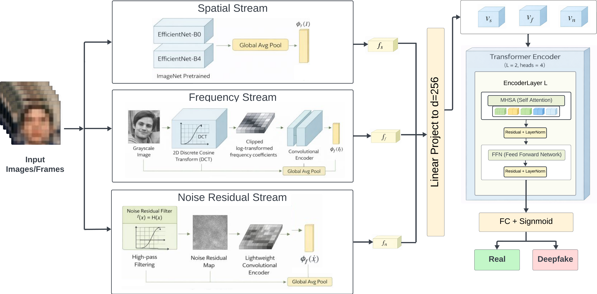

# SFA-Fuse (Spatial Frequency Attention Fusion) for Deepfake Detection in Low Resolution Images

This repository contains the official implementation of **SFA-Fuse**, a multi stream deepfake detection framework designed to remain robust under low resolution and distribution shift settings. The project focuses on combining spatial, frequency, and attention based cues to improve generalization where traditional RGB only models struggle.

> **Paper:**  
*Multi Stream Fusion of Spatial, Frequency, and Attention Features for Robust Deepfake Detection in Low Resolution Images*

---

## Overview

Deepfake detectors often fail when videos are compressed, resized, or evaluated outside their training distribution. SFA-Fuse addresses this limitation by jointly leveraging complementary representations rather than relying on a single visual stream.

The framework integrates  
• Spatial RGB features  
• Frequency domain representations using DCT based features  
• Noise residual cues capturing subtle manipulation artifacts  

These streams are fused using attention mechanisms that emphasize manipulation sensitive information while suppressing dataset specific bias. This design enables robust performance under low resolution conditions and out of distribution evaluation.

<p align="center">
  
</p>

---

## Core Features

• Multi stream fusion of spatial, frequency, and noise based features  
• Attention driven feature aggregation  
• Robust performance on low resolution inputs  
• Strong cross dataset generalization  
• Clean and modular PyTorch implementation  
• Reproducible training and evaluation pipeline  

---

## Datasets

SFA-Fuse was evaluated on two widely used deepfake detection benchmarks:

- **FaceForensics++**  
  A large scale dataset containing multiple manipulation methods with varying compression levels. Used for training, validation, and ablation studies.

- **CelebDF v2**  
  A challenging dataset with diverse identities and realistic deepfake videos. Used primarily for cross dataset and out of distribution evaluation.

---

## Installation

Clone the repository and install the required dependencies:

```bash
git clone https://github.com/codeghost116/SFA-Fuse.git
cd SFA-Fuse
pip install -r requirements.txt
```
